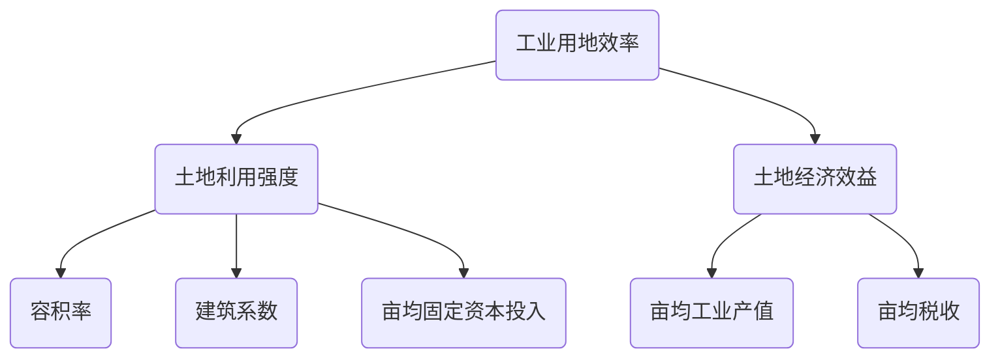
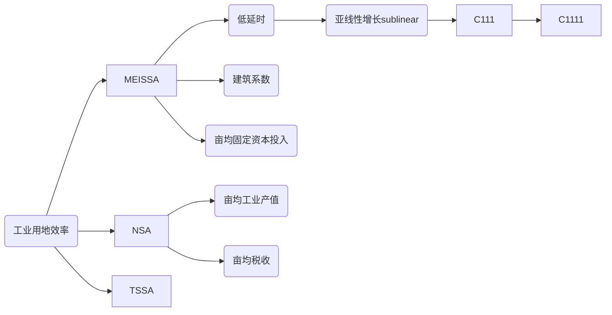
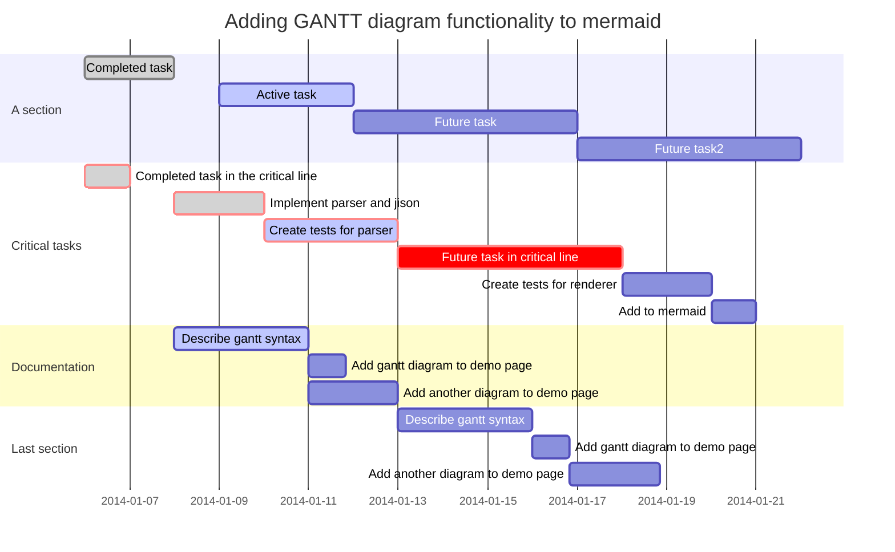
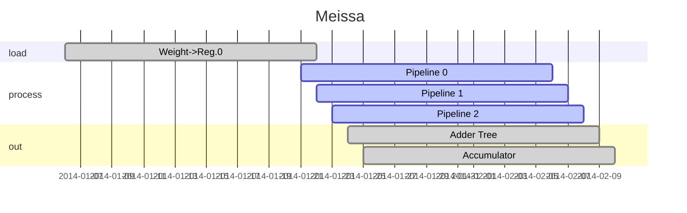

```mermaid
	graph TD
	A(工业用地效率)-->B1(土地利用强度)
	A-->B2(土地经济效益)
	B1-->C1(容积率)
	B1-->C2(建筑系数)
	B1-->C3(亩均固定资本投入)
	B2-->D1(亩均工业产值)
	B2-->D2(亩均税收)
```

```mermaid
	graph LR
    A(工业用地效率)

    A-->B1
	A-->B2
    A-->B3
    B1[MEISSA]
    B2[NSA]
    B3[TSSA]


	B1-->C1(低延时)
    C1-->C11(亚线性增长sublinear)
    C11-->C111
    C111-->C1111
	B1-->C2(建筑系数)
	B1-->C3(亩均固定资本投入)
	B2-->D1(亩均工业产值)
	B2-->D2(亩均税收)
    
```

```mermaid
    gantt
    dateFormat  YYYY-MM-DD
    title Adding GANTT diagram functionality to mermaid

    section A section
    Completed task            :done,    des1, 2014-01-06,2014-01-08
    Active task               :active,  des2, 2014-01-09, 3d
    Future task               :         des3, after des2, 5d
    Future task2              :         des4, after des3, 5d

    section Critical tasks
    Completed task in the critical line :crit, done, 2014-01-06,24h
    Implement parser and jison          :crit, done, after des1, 2d
    Create tests for parser             :crit, active, 3d
    Future task in critical line        :crit, 5d
    Create tests for renderer           :2d
    Add to mermaid                      :1d

    section Documentation
    Describe gantt syntax               :active, a1, after des1, 3d
    Add gantt diagram to demo page      :after a1  , 20h
    Add another diagram to demo page    :doc1, after a1  , 48h

    section Last section
    Describe gantt syntax               :after doc1, 3d
    Add gantt diagram to demo page      : 20h
    Add another diagram to demo page    : 48h
```

```mermaid
    gantt
    dateFormat  YYYY-MM-DD
    title Meissa

    section load
    Weight->Reg.0                :done, des1, 2014-01-06,16d

    section process
    Pipeline 0                :active,  des1, 2014-01-21, 16d
    Pipeline 1                :active,  des2, 2014-01-22, 16d
    Pipeline 2                :active,  des3, 2014-01-23, 16d    
    
    section out
    Adder Tree                :done,  des3, 2014-01-24, 16d
    Accumulator               :done,  des3, 2014-01-25, 16d
```

```mermaid

    gantt
    dateFormat  x
    axisFormat  %L
    title Meissa

    section load
    Weight (Data0)->Reg.0                :done, 0, 16
    Weight (Data1)->Reg.1                :crit,done, 16, 32

    section process
    Pipeline 0 (Data0)                :active, 15, 31
    Pipeline 1 (Data0)                :active, 16, 32
    Pipeline 2 (Data0)                :active, 17, 33

    Pipeline 0 (Data1)                :crit, active, 31, 47
    Pipeline 1 (Data1)                :crit, active, 32, 48
    Pipeline 2 (Data1)                :crit, active, 33, 49

```