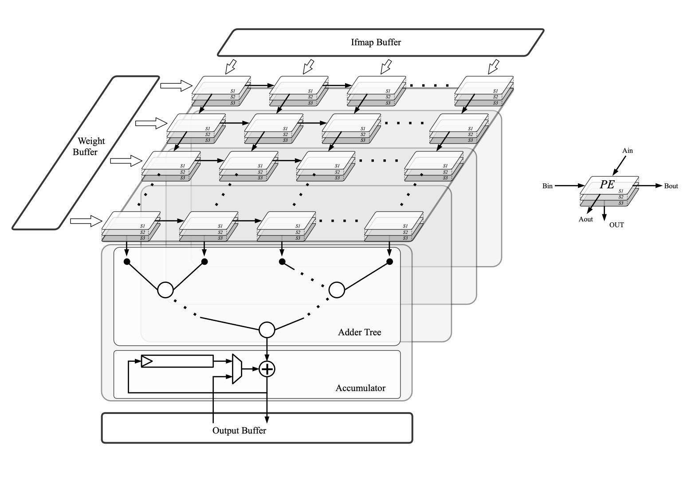
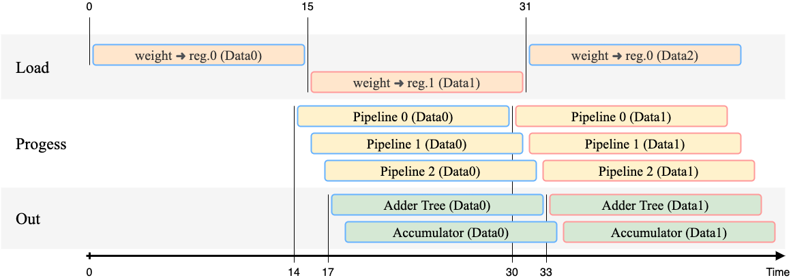

参考资料：
[[2020][ICCD]MEISSA: Multiplying Matrices Efficiently in aScalable Systolic Architecture.pdf](pdf/[2020][ICCD]MEISSA:Multiplying-Matrices-Efficiently-in-a-Scalable-Systolic-Architecture.pdf)

## 脉动形式

### NSA

### TSSA

### Meissa

#### load
将B的m列加载进PE内部的寄出去中（与TSSA的load相同）

Before the computation starts, matrix B m×p is inserted into the systolic array. 
Therefore, the number of steps to load depends on the dimension of B.

T_load = m

#### process
A以方阵的形式flow进入Systolic Array，每次进入1xm个数据。同时，这1xm个数据在Systolic Array的每一列中分别与load过程中PE保存的数据做乘法，并传给加法树做累加。

T_process = n+p-1

#### out
(上面的示意图有误，应该不是方阵而是平行四边形输出。即第一列跟最后一列相隔n个周期，因为对于输入A来说，第一列与最后一列的输入相隔了n个周期)

输出取决于加法树的时延

### 内部结构

(a) Meissa, made of an array of multipliers, connected to adder trees, and (b) the popular MAC-based schemes, which are the common microarchitecture in NSA and TSSA.

## Accelerator

采用Meissa的思路，但加入了pipeline设计、多输入浮点加法树设计、累加器设计、ping-pong设计。

pipeline设计：每个PE都是多周期执行乘法运算，这并不会影响Systolic dataflow及工作占空比。但是会影响整体时延。

累加器设计：长度可配置的linebuffer，可以通过长度信号改变多少个寄存器轮一个周期，可以配置当前的读/写地址（默认读写地址相同并每周期+1）

多输入浮点加法树设计：可以找到所有输入浮点数中指数最大的那个，并统一做移位。减少了多次比较&多次移位对于时延及能耗的损失。

ping-pong设计：使计算不需等待加载部分

## 其它工作
目前PE内部支持：
| MODE | PE行为 | Stage |
| :-:  |  :-:  |  :-:  | 
| FP64 | 1个FP64 x FP64 | 3 |
| FP32 | 4个FP32 x FP32 (并相加成1个FP32) | 3 |
| FP16 | 16个FP16 x FP16 (并相加成1个FP16) | 3 |

是否可以利用其内部的整型乘法器&整型加法器做到以下操作？

| MODE | PE行为 | Stage |
| :-:  |  :-:  |  :-:  | 
| SInt64 | 1个SInt64 x SInt64 | 2? |
| SInt32 | 4个SInt32 x SInt32 (并相加成1个SInt32) | 2? |
| SInt16 | 16个SInt16 x SInt16 (并相加成1个SInt16) | 2? |

同时，我们的累加器也要支持对应操作